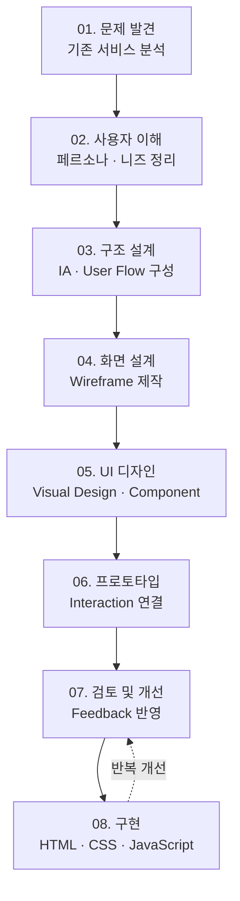

# 안녕하세요, UI/UX 웹디자이너 이은진입니다 👋

사용자의 입장에서 화면을 바라보고,  
보기 좋은 디자인을 넘어 사용하기 편한 인터페이스를 만드는 것을 목표로 합니다.

현재 UI/UX 디자인과 웹 퍼블리싱을 함께 공부하며,  
Figma로 설계한 화면을 HTML, CSS, JavaScript로 직접 구현하는 경험을 쌓고 있습니다.

---

## About Me

- 사용자 흐름을 고려한 UI 설계를 좋아합니다.
- Figma를 활용해 와이어프레임, 프로토타입, 디자인 시스템을 제작할 수 있습니다.
- HTML, CSS, JavaScript를 사용해 반응형 웹 페이지를 구현합니다.
- 브랜드의 분위기와 사용자의 목적이 잘 드러나는 웹사이트를 만들고 싶습니다.

---

## Skills

---

## Projects

### K-패스 웹사이트 리디자인
교통비 지원 서비스의 정보를 사용자가 쉽게 이해할 수 있도록 구조를 개선한 웹사이트 리디자인 프로젝트입니다.

- 기존 사이트의 정보 구조와 CTA 흐름 개선
- 이용 절차, 카드 발급, 공지/이벤트 영역 재구성
- HTML, CSS, JavaScript를 활용한 메인 페이지 구현

### Movie Community App, 무비니티
영화 감상 후 사용자들이 리뷰와 취향을 공유할 수 있는 커뮤니티 앱 디자인 프로젝트입니다.

- 온보딩, 로그인, 홈, 커뮤니티, 마이페이지 화면 설계
- 사용자 흐름 기반 IA 구성
- 모바일 UI 디자인 및 프로토타입 제작

### Twinings Website Redesign
브랜드 스토리와 제품 분위기를 강조한 PC 기반 웹사이트 리디자인 프로젝트입니다.

- 클래식한 브랜드 이미지와 현대적인 레이아웃 조합
- 메인 페이지 및 서브 페이지 구성
- 브랜드 무드에 맞춘 컬러와 콘텐츠 전략 설계

---
## Design Process

## Contact

Email. lejin0212@gmail.com
